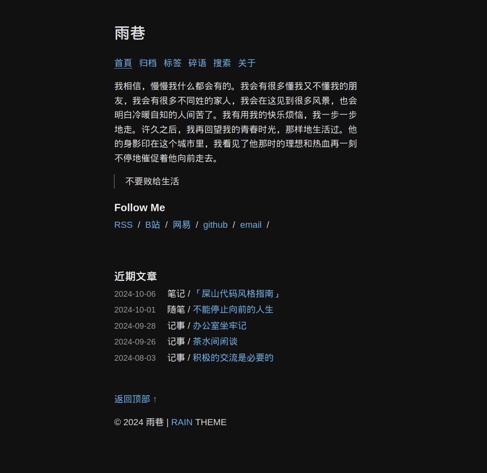

<h1>Rain</h1>

🌷 A simple, tiny, flash hugo theme .

## Why use rain?
- Tiny (~5kb), optimized, and awesome pages .
- Abandon fancy script effects ,  
  return to the essence of the blog — word .
- Provide search and [Memo](https://github.com/rainto0322/memo) page .

## Overview
